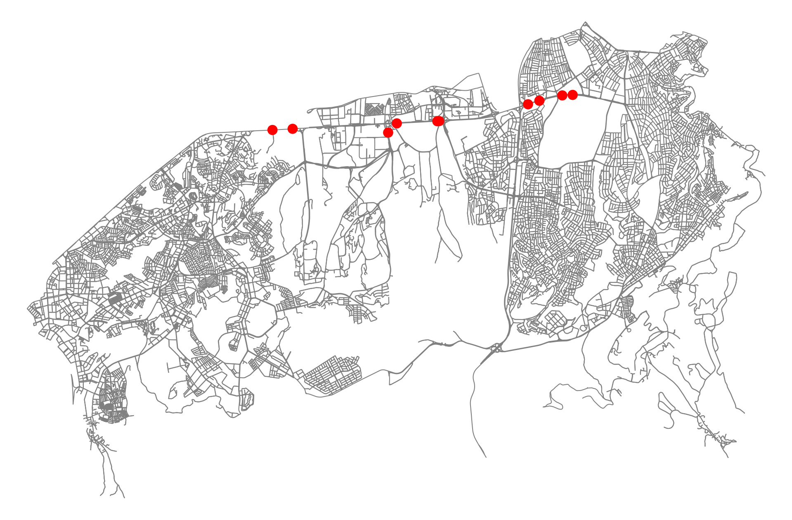
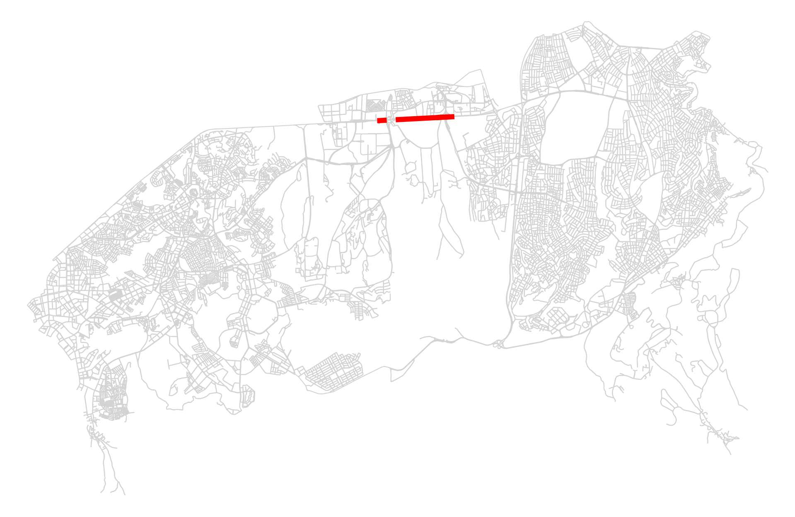
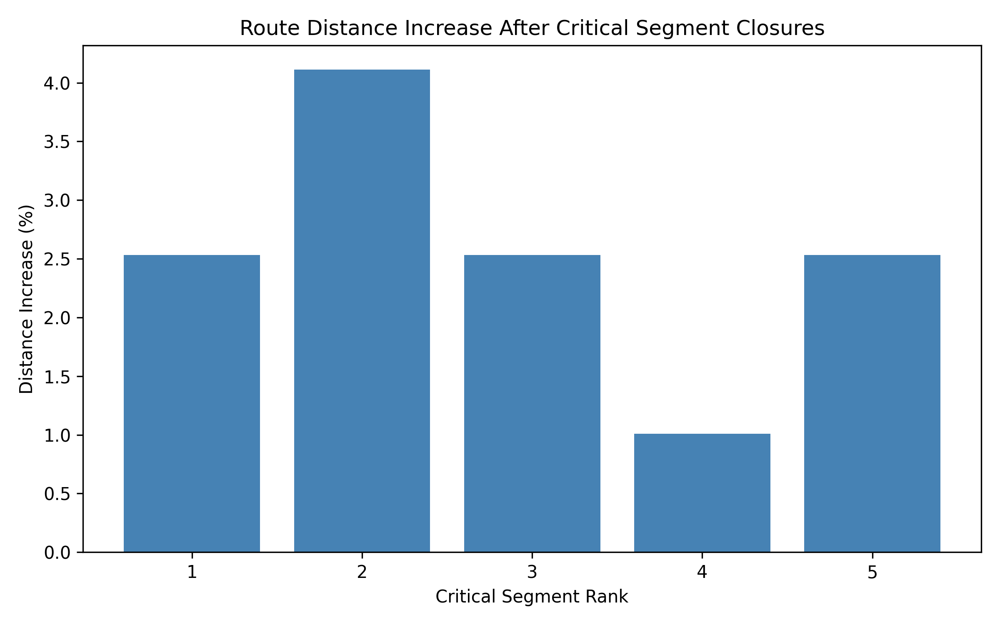

# Ankara Network Resilience

## Project Overview

Ankara Network Resilience is a student portfolio project that examines how selected road network elements in Çankaya, Ankara respond to simulated closures. The project uses OpenStreetMap road data to identify important nodes and road segments, then measures how a west-to-east route changes when critical segments are removed.

## Objective

The objective is to evaluate basic road network resilience by identifying central network elements and testing whether alternative routes remain available after selected road segment closures.

## Study Area

Çankaya, Ankara, Turkey

## Data Source

Road network data was extracted from OpenStreetMap using OSMnx.

## Main Methods

- Road network extraction
- Shortest path analysis
- Betweenness centrality
- Critical node detection
- Critical road segment detection
- Road closure simulation
- Alternative route analysis

## Key Results

- Original route distance: 28.89 km
- Highest observed alternative route distance: 30.07 km
- Highest distance increase: 1.19 km
- Highest percentage increase: 4.11%
- The tested critical segments remained reachable after closure simulations.

These results suggest that some road segments create larger detours when unavailable, while the network still provides alternative routes for the tested west-to-east route.

## Limitations

- This is a network-topology-based analysis.
- No real-time traffic volume, travel time, congestion, accident, or sensor data were used.
- The analysis uses one west-to-east origin-destination route.
- Approximate betweenness centrality was used with `k=200`.

## Technologies

- Python
- OSMnx
- NetworkX
- GeoPandas
- Pandas
- Matplotlib

## Project Structure

```text
ankara_network_resilience/
├── analyze_network.py
├── multi_segment_analysis.py
├── plot_critical_nodes.py
├── plot_critical_segments.py
├── plot_resilience_results.py
├── resilience_test.py
├── test_network.py
├── outputs/
│   ├── cankaya_network.png
│   ├── critical_nodes.png
│   ├── critical_segments_map.png
│   ├── resilience_bar_chart.png
│   └── segment_resilience_results.csv
├── requirements.txt
├── .gitignore
└── README.md
```

## How to Run

Create and activate a virtual environment, then install the project dependencies:

```bash
python -m venv venv
source venv/bin/activate
pip install -r requirements.txt
```

Run the scripts from the project root:

```bash
python test_network.py
python analyze_network.py
python plot_critical_nodes.py
python resilience_test.py
python multi_segment_analysis.py
python plot_resilience_results.py
python plot_critical_segments.py
```

## Results / Visualizations

### Critical Nodes



### Critical Road Segments



### Distance Increase After Segment Closures


