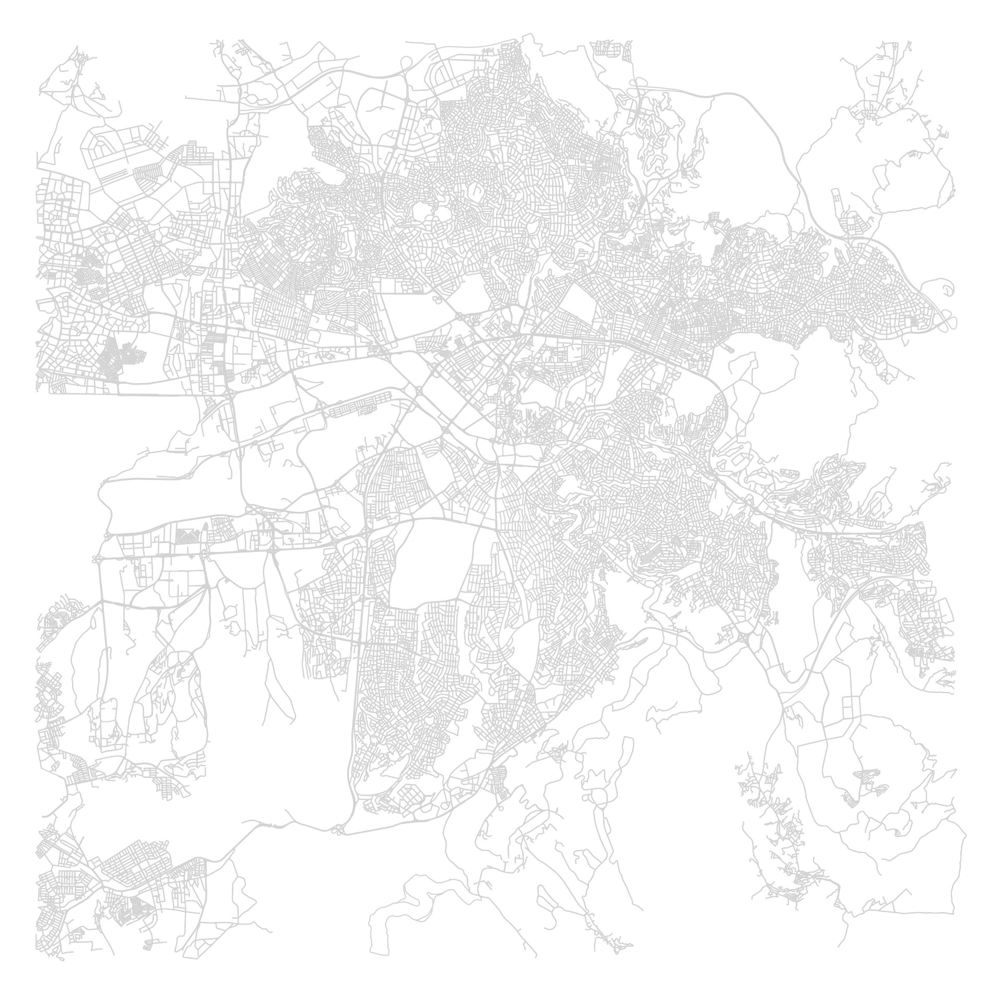
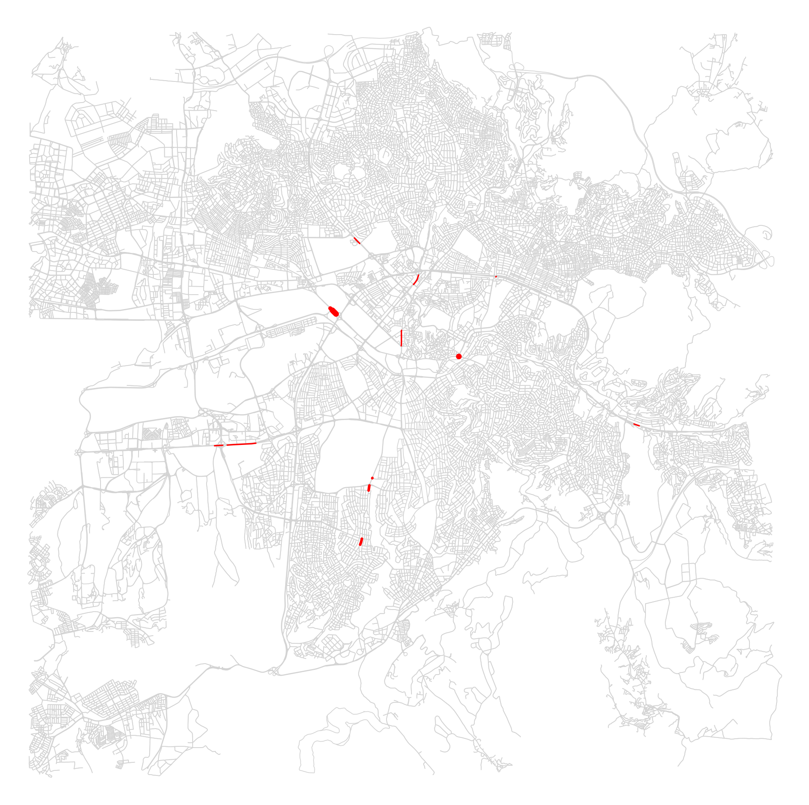

# Ankara Network Resilience

## Project Overview

Ankara Network Resilience is a student portfolio project that studies road network resilience using OpenStreetMap data and network analysis methods. The project started as a Çankaya pilot study focused on one west-to-east route, then expanded into a broader Ankara urban core analysis using multiple origin-destination routes.

The goal is to identify road network elements that may create longer detours when unavailable, while avoiding claims based on real-time traffic conditions.

## Phase 1 — Çankaya Pilot Study

The first phase tested the workflow on Çankaya, Ankara, Turkey. Road network data was extracted from OpenStreetMap via OSMnx, and the analysis focused on a single west-to-east driving route.

Main methods used in this phase:

- Shortest path analysis
- Betweenness centrality
- Critical node detection
- Critical road segment detection
- Road closure simulation
- Alternative route analysis

Key results:

- Original route distance: 28.89 km
- Highest observed alternative route distance: 30.07 km
- Highest distance increase: 1.19 km
- Highest percentage increase: 4.11%
- The tested critical segments remained reachable after closure simulations.

These results suggest that some segment closures created larger detours, while alternative routes remained available for the tested Çankaya route.

### Çankaya Visualizations


## Phase 2 — Ankara Urban Core Extension

The second phase expanded the analysis beyond the single Çankaya route to a wider, multi-route network study.

Study area:

- Kızılay-centered 12 km drivable road network
- Ankara urban core

Network size:

- 34,383 nodes
- 91,875 edges

Multi-route analysis:

- 10 origin-destination routes tested
- Average route distance: 26.06 km
- Shortest route distance: 20.24 km
- Longest route distance: 33.07 km

Critical segment frequency analysis:

- 30 total critical segment occurrences
- 19 unique critical segments
- 6 segments appeared in more than one route
- Maximum route frequency: 4

Route frequency represents how often the same road segment appeared among the top critical segments across different routes. Repeated critical segments may indicate structurally important connections that influence multiple trips across the study area.

Supporting CSV files:

- `outputs/core_multi_route_segments.csv`
- `outputs/core_segment_frequency.csv`

### Ankara Urban Core Visualizations





## Methodology

Across both phases, the project uses:

- Road network extraction with OSMnx
- Largest strongly connected component filtering
- Shortest path routing using edge length
- Approximate edge betweenness centrality using `k=200` and `seed=42`
- Critical road segment detection
- Road closure simulation for the Çankaya phase
- Multi-route frequency analysis for the Ankara urban core phase

## Limitations

- This is a network-topology-based analysis.
- No real-time traffic volume data were used.
- No travel time or congestion data were used.
- No accident or sensor data were used.
- Approximate betweenness centrality was used.
- Route selection is synthetic and based on geographically distributed origin-destination anchors.
- Identified critical segments should not be interpreted as observed traffic bottlenecks.

## Technologies

- Python
- OSMnx
- NetworkX
- GeoPandas
- Pandas
- Matplotlib

## Project Structure

```text
ankara_network_resilience/
├── analyze_network.py
├── ankara_core_analysis.py
├── core_segment_frequency_analysis.py
├── multi_route_core_analysis.py
├── multi_segment_analysis.py
├── plot_core_critical_segments.py
├── plot_critical_nodes.py
├── plot_critical_segments.py
├── plot_resilience_results.py
├── resilience_test.py
├── test_network.py
├── outputs/
│   ├── ankara_core_network.png
│   ├── cankaya_network.png
│   ├── core_critical_segments_map.png
│   ├── core_multi_route_segments.csv
│   ├── core_segment_frequency.csv
│   ├── critical_nodes.png
│   ├── critical_segments_map.png
│   ├── resilience_bar_chart.png
│   └── segment_resilience_results.csv
├── requirements.txt
├── .gitignore
└── README.md
```

## How to Run

Create and activate a virtual environment, then install the project dependencies:

```bash
python -m venv venv
source venv/bin/activate
pip install -r requirements.txt
```

Run the scripts from the project root.

Phase 1 — Çankaya pilot study:

```bash
python test_network.py
python analyze_network.py
python plot_critical_nodes.py
python resilience_test.py
python multi_segment_analysis.py
python plot_resilience_results.py
python plot_critical_segments.py
```

Phase 2 — Ankara urban core extension:

```bash
python ankara_core_analysis.py
python multi_route_core_analysis.py
python core_segment_frequency_analysis.py
python plot_core_critical_segments.py
```
